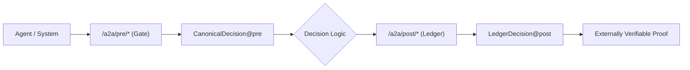

# LCM — Blockchain guarantees. API speed.

LCM delivers verifiable proof at API speed.  
Decision-time separated. Zero grey zones.

No speculation.  
No deferred trust.

In an era of autonomous AI,  
**trust isn’t granted — it’s proven.**

**Proof. Not Promise.**

▶ **Try it now — Understand LCM in 5 minutes**  
https://github.com/paibyun9/LCM-a2a-spec/blob/main/docs/understand-lcm-in-5-minutes.md

---

## Core Architecture (V5 · LOCKED)

Decision-Time Split (Hard Boundary)

| Layer | Purpose | Route | Schema |
|------|--------|-------|--------|
| Gate (Pre) | Decision intent only | /a2a/pre/* | CanonicalDecision@pre |
| Ledger (Post) | Verifiable proof | /a2a/post/* | LedgerDecision@post |

**Invariant**

- pre cannot depend on outcome evidence  
- post cannot modify intent  
- No shared mutable state  
- No “gray zone” logic  

---

## Access Levels (API Permission Model)

| Tier | Access Scope | Description |
|------|--------------|-------------|
| Tier-1 | Pre only | Intent evaluation (no proof exposure) |
| Tier-2 | Post only | Ledger verification / auditing |
| Partner | Pre + Post | Full decision → proof pipeline |

This separation is enforced by design, not convention.

---
## The Whole Picture

If you break this flow,
you are no longer running LCM.

Step Model (V5 · 5 Step · SCORP)
Health & Liveness
System availability and version lock

Pre — Intent Only
Deterministic decision intent
No evidence binding

Evidence Binding
Hash, signature, reference only

Post — Ledger Commit
Immutable proof generation

External Verification
Third-party reproducibility

Live Endpoints (Public)
Canonical Decision (Demo)
GET http://18.118.171.174/a2a/eval

Browser Demo
http://18.118.171.174/demo

Interactive API (Swagger)
http://18.118.171.174/docs

/docs is the only intended human-facing API surface.
OpenAPI JSON is internal-use only.

CTO Checklist
Deterministic decision surface

Schema-first contracts

Explicit pre/post separation

Zero ambiguous logic

Auditable by default

External-shareable by default

If any item fails,
the system is not production-safe.

Non-Goals (Explicit)
LCM does not:

Optimize UX flows

Explain decisions in natural language

Replace policy engines

Hide uncertainty

LCM exists to justify decisions, not decorate them.

Final Note
Stripe helps you process payments.
LCM helps you justify decisions.

When autonomous systems act,
proof becomes infrastructure.

Proof. Not Promise.

README LOCK STATUS
Version: V5

Mode: SCORP

Change Policy: Breaking-change only

Ambiguity Tolerance: Zero
