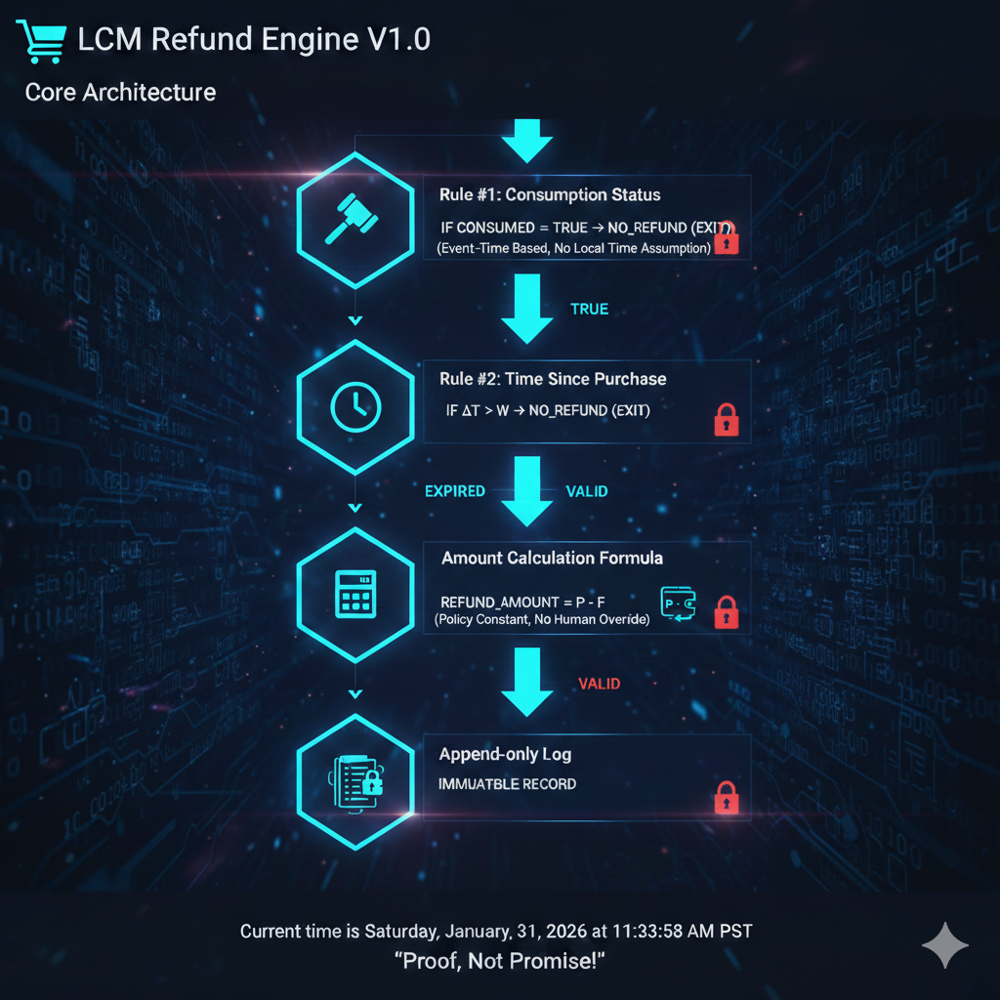

# LCM — Lawful Computation Middleware

[Constitution: v1.0 LOCKED] [Status: ACTIVE]

LCM is not a decision-making AI.  
LCM is a deterministic execution system that applies policies exactly as written — without interpretation, discretion, or exception.

---

## 🔒 What LCM Is (and Is Not)

**LCM is:**
- A constitution-driven middleware
- A proof-generating execution engine
- A system where outcomes are mechanically derived from policies

**LCM is NOT:**
- A judge, arbitrator, or reasoning agent
- A probabilistic or adaptive AI
- A system that handles exceptions, fairness, or intent

---

## ⚙️ Core Principles

| Principle | Mechanical Reality |
| :--- | :--- |
| **Deterministic** | Identical inputs + identical policy = identical outcome |
| **Gray Zone 0** | No intermediate decision space; no “pending review” |
| **Policy Snapshot** | Outcomes are anchored to the policy effective at the moment of the event |
| **Non-Punitive** | Suspension or revocation is a state transition, not a penalty |

## Deterministic Refund Engine (E4 Preview)

This engine demonstrates a fully deterministic,
policy-locked execution flow with:
- No human override
- Time-based evaluation
- Append-only immutable logs

### Gray Zone 0 Logic

Input + Policy → Outcome
ΔJudgment = 0

There is no “maybe,” no escalation, and no discretionary override.

---

## 🧭 How LCM Operates

LCM enforces a strict **Pre / Post** execution model:

- **Pre**: Policy validation, eligibility checks, and snapshot anchoring  
- **Post**: Proof emission and deterministic outcome reporting  

No logic exists between these phases.

---

## 🔑 API Access & Consent

Access to LCM APIs is **not automatic**.

API eligibility is granted **only after explicit consent** to the E1 Constitution.  
Consent acts as the **trigger for a system state transition** from ineligible → eligible.

Using an LCM-issued API key implies ongoing agreement to the Constitution and all governing terms.

---

## 📘 Authoritative Documents

- **E1 Constitution (LOCKED)**  
  `constitution/E1_Constitution_v1.md`

- **E1 Annex — Locked Zones**  
  `constitution/E1_ANNEX_Locked_Zones_v1.md`

- **E2 Human Guide**  
  `docs/E2/E2-1.md`  
  `docs/E2/E2-2.md`  
  `docs/E2/E2-3.md`  
  `docs/E2/E2-4.md`  
  `docs/E2/E2-5.md`

---

## 🔍 API Reference

Interactive API documentation is available **only as a reference** and may be gated by eligibility state:

/docs/api

LCM does not hide its proofs.  
It hides only the ability to execute them without consent.

---

## 🧠 Final Note

LCM does not promise outcomes.  
LCM produces proof.

**Proof. Not Promise.**

